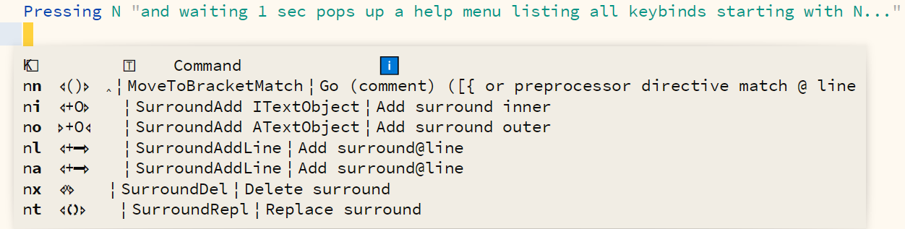
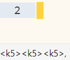
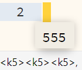

<div align="center">
    <p>
        <a href="https://github.com/NeoVintageous/NeoVintageous/actions/workflows/ci.yml">
            
        </a>
        <a href="https://codecov.io/gh/NeoVintageous/NeoVintageous">
            
        </a>
        <a href="https://packagecontrol.io/packages/NeoVintageous">
            
        </a>
        <a href="https://github.com/NeoVintageous/NeoVintageous/stargazers">
            
        </a>
    </p>
</div>

## About this fork of NeoVintageous

NeoVi18nt extends NeoVintageous plugin for Sublime Text by adding:
  - User events on mode change
    + set your "exit Insert mode" command to hold 🠿<kbd>i</kbd> to avoid typo-prone or inconvenient key sequences by setting an `isNVⓘ` variable to `1` via Karabiner Elements (macOS), and sending <kbd>⎋</kbd> when it's `1` on 🠿<kbd>i</kbd>
    + alternatively (on Windows) set up a windows message listener in AutoHotkey and get message notifications on mode changes with the numeric code of the new mode
      - might require manual installation of the Pywin32 dependency after adding [this repo](https://github.com/eugenesvk/Pywin32) to the Package Control (if the defauld dependency resolution via the new [Package Control Libraries](https://github.com/packagecontrol/channel) channel is bugged)
      - to get the numeric code of all modes, run in Sublime Text's console:
      ```py
      from NeoVintageous.nv.modes import M_EVENT, M_ANY, Mode as M, text_to_modes, mode_names_rev,mode_clean_names_rev
      print(f"integer values for NeoVintageous modes")
      for m in M_ANY:
        print(f"{m} = {m+0}")
      ```
      - For a basic AutoHotkey example see [listen_WinMsg](./doc/listen_WinMsg.ahk)

  - Internationalization support of:
    + ✨ non-QWERTY/non-Latin layouts based on custom user `keymap` dictionary in `User/NeoVintageous.kdl` (see [example config](./NeoVintageous.help.kdl)). Requires manually running `NeoVintageous: Generate non-QWERTY keymap` command to convert default NeoVintageous keybinds to use this keymap
    + ✨ non-Latin keybinds, e.g., `noremap ц b` (or `(n)ц b`) to move back by word when a Cyrillic layout is on (does not work with modifier keys since Sublime Text doesn't report non-Latin keys in key combos, see [this ST issue](https://github.com/sublimehq/sublime_text/issues/5980))
  - ✨ better configuration file format `NeoVintageous.kdl` (see [example](./NeoVintageous.help.kdl)) with:
    + Fewer useless quotes:
      ```
       plugin    {  surround    {  punctuation_marks    ‘ = ‘’    “ = “”    ‹ = ‹›   « = «» }}
      "plugin" : { "surround" : { "punctuation_marks":{"‘":"‘’", "“":"“”", "‹":"‹›","«":"«»"}} },
      ```
    + Inline comments:
      ```
      punctuation-alias clear/*clear defaults d=")" B="}" r="]" a=">" }*/\
                                              d="(" f="[" g=‘ h=“
      ```
    + Support for raw strings so you don't need to escape anything:
      ```
       upper 	 #"l;'\"
      "upper"	: "l;'\\",
      ```
    + Shorter general config option names without the `neovintageous_` prefix (`default_mode normal` instead of `"vintageous_default_mode" : "normal",`
    - BUT automatic reload on file change isn't supported, use `NeoVintageous: Reload config` command manually
  + ✨ support for importing other config files
    ```
    import (keybind)NeoVintageous.key.kdl
    /*↑import file name ↑ relative to this main config file or an absolute '/'-prefixed path since this calls pathlib's 'Path(main_config_folder, import_value)' docs.python.org/3/library/pathlib.html
    group values↑ in ‘keybind{}’, so the file itself can include only top-level ‘key command’ lines
    */
    ```
  + ✨ human-readable format for setting keyboard shortcuts<br/>
    `(nv)d MoveByWordsBackward // understandable command name`<br/>
    instead of `.neovintageousrc`'s<br/>
    `nnoremap d b` why do you need to remember that `b` moves by words backwards if you never use it?<br/>
    `vnoremap d b "b=MoveByWordsBackward` oh, and you can't even add a comment on the same line to clarify it<br/>
    And the whole `noremap` doesn't need to be repeated on every single line
    + command repeat count in keybinds: `(Ⓝ)d (⋅4)MoveByBigWordsBackward` (or `№` `⌗` `c` `n` `×` `⋅` prefix) will move by 4 Words
    + list of commands is executed as a single chain without the need to specify `chain` command: `(Ⓝ)q MoveByBigWords MoveByBigWords`
    + `chain` argument to add node children as a sequence of commands for the same keybind (in case they need to set their own properties)
      ```kdl
      (Ⓝ)q MoveByBigWords chain {
        ↓/*node names are ignored*/ MoveByBigWords
        - #":"command":"move","args":{"by":"words","forward":true,"extend":true}<CR>"#
      }
      ```
    + template variables to, e.g., import the same keybind with a single modifier variation per mode to make them toggle relative lines with <kbd>[</kbd> in Normal mode and <kbd>⎈</kbd><kbd>[</kbd> in Insert mode
      `NeoVintageous.keyB.kdl` file (`‘’` are default template variable pre/pos delimiters)
      ```kdl
      (‘m’)"‘ipre’[‘ipos’" ":set invrnu<CR>"
      ```
      `NeoVintageous.key.kdl` file that will import ↑
      ```kdl
      import NeoVintageous.keyB.kdl m=(var)Ⓝ ipre=(var)""  ipos=(var)""  //  (Ⓝ)[
      import NeoVintageous.keyB.kdl m=(var)ⓘ ipre=(var)<C- ipos=(var)>  //  (ⓘ)<C-[>
      ```
      (or `$` instead of `var` like `ipre=($)""`)
      Can also pass variables through to subsequent imports via the `varpass` tag, e.g.:
        - @`NeoVintageous.kdl`: `import cfgA.kd m=(var)Ⓝ` (or `($)Ⓝ`) defines variable `m` as a normal mode
        - @`cfgA.kdl`: `import cfgB.kd m=(varpass)""` (or `($→)""`) passes the value of `m` further
        - @`cfgB.kdl`: `(‘m’)a MoveToEol` will get `Ⓝ` as the value of `m`

    + group keybinds under a single mode without having to repeat mode's name in each keybind
      ```kdl
      (Ⓝ)my_normal_group {
        d "MoveByBigWordsBackward"
        f "MoveByBigWords"
      }
      ```
    + execute Sublime Text commands by writing arguments in a `prop=value` format
      ```kdl
      (Ⓝ)r (subl)move by=words forward=#true extend=#false
      //-  #":"command":"move","args":{"by":"words","forward":true,"extend":false}<CR>"#
      // ! but this is NOT suitable for chains since prop=val in KDL do not maintain position vs. arguments, so to execute multiple Sublime Text commands with arguments you'd still need to "chain them"
      (Ⓝ)t "chain" {
        - (⋅5subl)move by=words forward=#true extend=#false
        - (⋅5subl)move by=words forward=#true extend=#true
      }
      // ! also, this doesn't work for nested arguments, those still require pasting the full json snippet
      ```
  - Support nicer configuration even in the old format:
    + ✨ support for raw Sublime Text commands in user config without having to convert their names or arguments (or just the command names by adding extra `:` prefix)
    + ✨ rudimentary foundations to support custom key symbols in user config, e.g., `noremap ⇟ w` to move by word with a <kbd>⇟</kbd>PageDown key
    + ✨ use `Ⓝ` `ⓘ` icons (instead of `vi_command_mode_aware`) as mode limits on Sublime Text native keybinds (defined in `.sublime-keymap` files), e.g., to delete a word with <kbd>Alt</kbd><kbd>X</kbd>, but only in Insert mode:<br/>
      `{"keys":["alt+x"],"command":"delete_word","context":[{"key":"ⓘ"}]},` 
  + Improved aesthetics:
    + (user configurable) status icons for command indicators: if you use <kbd>r</kbd> to record a macro, it doesn't make sense to see `q` in the statusbar just because the default keybind is <kbd>q</kbd>. Instead you see a recording symbol ⏺ or can add your own in the `i="⏺"` keybind field
    + ✨ delayed key help popup (no popup if you press the full keybind quickly)<br/>
    + ✨ show a popup with a count indicator<br/>before after
    + ✨ allow user to set values of various indicators:
      + for `macros` recording, e.g., short bright `🔴w` instead of the long gray `recording @w`
      + for `ls` command, e.g., replace `+` modified file mark with `🖉` similar to how a modified tab is marked
      + for `registers` command, e.g., replace `l` for linewise with `━`
  + Extended user configuration:
    + ✨ surround: allow users to configure marks, mark aliases, when to append an extra space
    + ✨ surround: option to not seek the next set brackets if current text isn't enclosed in one — `⎀a(b)` with surround  delete will result in:
      - `⎀a(b)` if `seek_forward` is `false` (default)
      - `⎀ab`   if `seek_forward` is `true`
    + ✨ surround: option to maintain cursor position on text edits, e.g., adding `'` to `my_⎀word` (⎀ denotes cursor position) will leave cursor at the same spot in the new `'my_⎀word'` while previously it moved it to the first inserted punctuation `⎀'my_word'`
    + ✨ surround: option to customize function prefix (`f` `F`)
    + ✨ abolish: allow users to configure case coercion aliases
    + ✨ abolish: option to maintain cursor position on case changes, e.g., converting `se⎀View⎀Sel_⎀Reverse` to upper case (⎀ denotes cursor position) will leave cursor at the same spot in the new `SE_⎀VIEW_⎀SEL_⎀REVERSE` while previously it moved it to the beginning of the word `SE_VIEW_SEL_REVERSE`
    + ✨ marks: option to customize back aliases: `'` \`
    + ✨ UnImpaired: option to customize option aliases
    + `GotoTargetPrev`/`GotoTargetNext` commands to allow using the brackets as arguments instead of as names<br/>
      `(Ⓝ)gdd" "GotoTargetPrev" "‹"` vs<br/>
      `(Ⓝ)gdd" "GotoTargetPrevWhateverThatBracketIsNamed"`
    + More keybinds:
      + support for rebinding Ctrl/Win/Alt key combos in Insert mode (they're still ignored by default unless explicitly enabled via the `handle_keys` config to not break all of the default Sublime Text's combos with these modifiers, also <kbd>Alt</kbd><kbd>F1</kbd>... function key combos are ignored by default)
     + <kbd>⎈</kbd><kbd>,</kbd>/<kbd>\\</kbd> are bindable
  - and other changes:
    + support for text object pairs as targets for the goto command
    + ✨ nowrap alternative to tab switch Ex commands (`tabnextnowrap`/`tabpreviousnowrap`)
    + ✨ add a `MoveHalfScreenHorizontally` command to move to the visual line's middle (helful with wrapped lines)
    + enabled a bunch of command to work in Insert mode (this limitation should be part of keybindings, not command functions)
    + ✨ support for count to the screen top/bottom movement commands, e.g., can move to line 5 from the visible top
    + ✨ search command for an unbounded string under cursor matches <kbd>g</kbd><kbd>#</kbd>/<kbd>*</kbd> vim commands
    + `MoveByWordEndsNoSep`,`MoveByWordEndsBackwardNoSep` command to move to word's end ignoring punctuation
      old: `wordA, wordB` would stop at `A` `,` `B`
      new: `wordA, wordB` would stop at `A`     `B`
  - Requires Sublime Text 4081  7 August 2020 to use the newer Python version and some new ST's APIs

## Settings

Preferences and initialization `vimrc` commands are consolidated into a single new config file: run `Command Palette` → `Preferences: NeoVintageous New Settings (KDL)` to open
  - your `NeoVintageous.kdl` consolidated config and
  - a `NeoVintageous.help.kdl` helper file with the list of supported settings

Reload with `NeoVintageous: Reload config` on changes (autoreload is not supported)<br/>
Or open only `NeoVintageous.kdl`: run `NeoVintageous: Open new config file (KDL)`<br/>
Or open only `NeoVintageous.help.kdl`: run `NeoVintageous: Open new config file example (KDL)`)

The old `.neovintageousrc` config continues to work as is, just that the new config is loaded later and overrides its options

If you're using the old KDL v1 config version, set `"nv_kdl_v":1,` in your `Preferences.sublime-settings` to avoid console log error spam from KDL v2 default parser trying to load v1 config first

## Known Issues

- delayed key help popup can't be a properly formatted table because Sublime Text's minihtml is too limited and doesn't support tables (upvote [fr](https://github.com/sublimehq/sublime_text/issues/3262) and [fr](https://github.com/sublimehq/sublime_text/issues/1105) to hopefully change that in the next decade or so)
- Python-based KDL config parser is slow, to use a fast C-based parser instead: set up the [ST's 3.8 lib channel](https://github.com/packagecontrol/channel), then `ckdl` should be automatically installed (or you can force it via `Package Control: Satisfy Libraries`). It's configured to be used by default, to revert to the vendored Python-based version configure to use it by adding `"nv_kdl_parser": "py",` (default is `"ckdl"`) to your user `Preferences.sublime-settings`

## About NeoVintageous

NeoVintageous is a powerful Vim emulator for [Sublime Text](https://www.sublimetext.com/). Designed to be fast, reliable, and with zero configuration required. A fork of Vintageous, it is the ideal drop-in replacement.

## Documentation

To check out docs, visit [neovintageous.github.io](https://neovintageous.github.io).

## Contributing

The contribution guide can be found in the [NeoVintageous documentation](https://neovintageous.github.io/contributing).

## Changelog

See [CHANGELOG.md](CHANGELOG.md).

## License

Released under the [GPL-3.0-or-later License](LICENSE).
